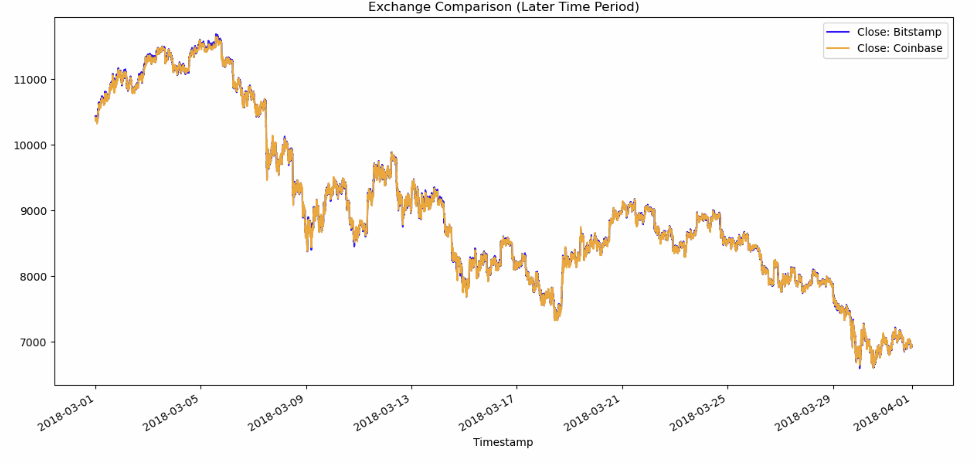
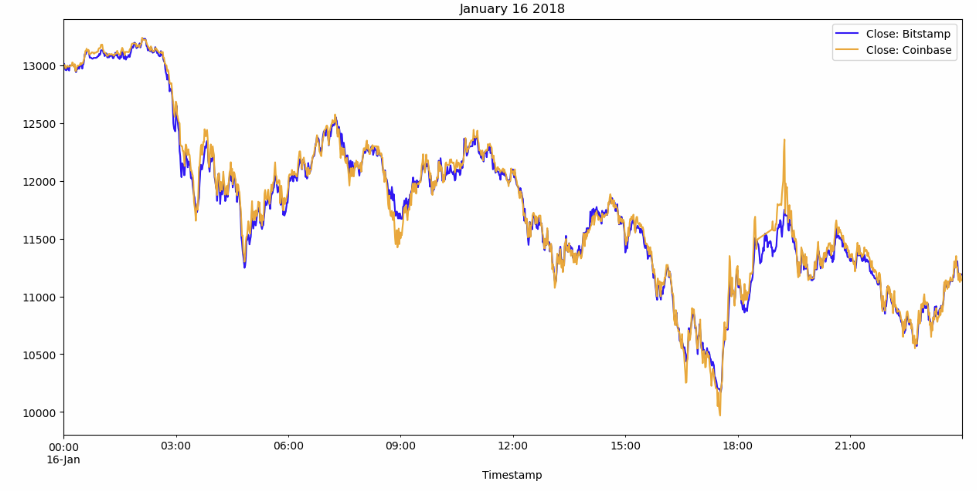
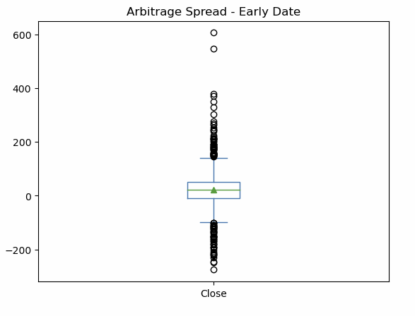
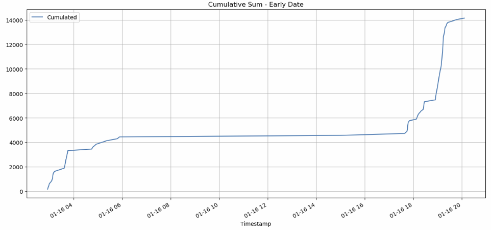

# Crypto-arbitrage-analysis
This is data analysis about `Bitcoin arbitrage` on 2018, the analysis use the original price from Coinbase and Bitstamp during January to March 2018. Since Coinbase and Bitstamp have price difference during that period of time, the purpose of this project is using Pandas to do the batch calculation and check how much accumulated profit can be made.

---

## Technologies

1. Clean data
   1. Remove null values
   2. Remove duplicate values
   3. Type cast data
   4. Manipulate string
2. Analyze data
   1. Batch calculation
   2. Time stamp index match
   3. Logic boolean selection
3. Plot
   1. Same axis line plot
   2. Summary box plot
   3. Cumulative plot
---

## Installation Guide

```python
# To run this analysis, you need Pandas, matplotlib libraries from Python
import pandas as pd
import matplotlib.pyplot as plt
import warnings
from pathlib import Path
warnings.filterwarnings("ignore")
%matplotlib inline
```

---

## Usage
#### Description
This is data analysis about `Bitcoin arbitrage` on 2018, the analysis use the original price from Coinbase and Bitstamp during January to March 2018. Since Coinbase and Bitstamp have price difference during that period of time, the purpose of this project is using Pandas to do the batch calculation and check how much accumulated profit can be made.   
#### Processing
* Compare Coinbase and Bitstamp price during January and March 2018   
   
* Check a particular date January 16 2018 Price difference   
   
* January 16 2018 statistic summary   
   
* By arbitrage analysis we could made 14147.17 `Cumulated Return` in that particular date   

---

## Contributors

Shu Liu   
shu@liu.net

---

## License

MIT License

Copyright (c) 2024 Shu

Permission is hereby granted, free of charge, to any person obtaining a copy
of this software and associated documentation files (the "Software"), to deal
in the Software without restriction, including without limitation the rights
to use, copy, modify, merge, publish, distribute, sublicense, and/or sell
copies of the Software, and to permit persons to whom the Software is
furnished to do so, subject to the following conditions:

The above copyright notice and this permission notice shall be included in all
copies or substantial portions of the Software.

THE SOFTWARE IS PROVIDED "AS IS", WITHOUT WARRANTY OF ANY KIND, EXPRESS OR
IMPLIED, INCLUDING BUT NOT LIMITED TO THE WARRANTIES OF MERCHANTABILITY,
FITNESS FOR A PARTICULAR PURPOSE AND NONINFRINGEMENT. IN NO EVENT SHALL THE
AUTHORS OR COPYRIGHT HOLDERS BE LIABLE FOR ANY CLAIM, DAMAGES OR OTHER
LIABILITY, WHETHER IN AN ACTION OF CONTRACT, TORT OR OTHERWISE, ARISING FROM,
OUT OF OR IN CONNECTION WITH THE SOFTWARE OR THE USE OR OTHER DEALINGS IN THE
SOFTWARE.
